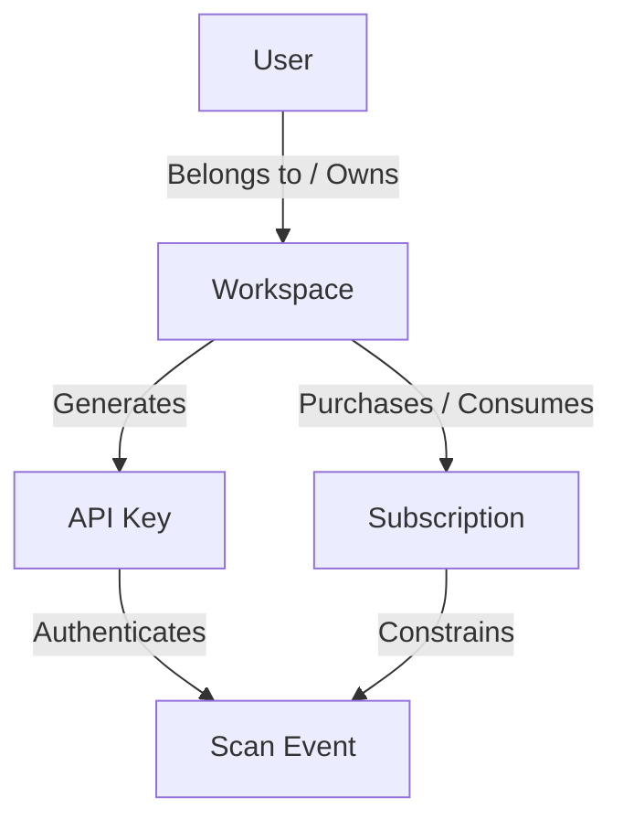

# Canonical Identity Chain Architecture

To make Krixai a true multi-tenant AI-security SaaS, every operational entity and billing constraint must flow securely from a canonical identity chain. We avoid mock data, hardcoded keys, and fake operational claims.

The identity chain defines the hierarchy of ownership, billing, and access control:

### 1. User
- Authenticated via Supabase Auth (or equivalent).
- Represents a physical person.
- Can belong to one or more Workspaces via a many-to-many relationship (e.g., `workspace_members` table).

### 2. Workspace
- The primary tenant entity.
- All resources, configurations, API keys, and billing are tied to a Workspace, not directly to a User.
- Ensures team collaboration (multiple users can manage the same workspace).

### 3. Subscription
- Attached exclusively to a Workspace.
- Defines the plan (e.g., Starter, Growth, Enterprise) and constraints (e.g., included scans per month).
- Enforced atomically during API requests (e.g., checking if the workspace has remaining scans before authorizing a scan).

### 4. API Key
- Generated for a specific Workspace.
- Used by the customer's application to authenticate with the Security API (`KRIXAI-V1`).
- The API Key resolves back to the `workspace_id`, enabling the backend to look up the active Subscription and apply limits.

### 5. Scan Event
- The core operational unit (a prompt being scanned for injections/threats).
- Authenticated by the API Key.
- Deducted from the Workspace's Subscription quota.
- Logged against the Workspace for the customer to view in their Threat Analytics Dashboard.

---
**Core Principles for Implementation:**
- **No Mock Data:** All customer-facing pages (dashboards, logs, api keys) must fetch real data from the database.
- **Server-Side Authorization:** The `workspace_id` must be derived from the authenticated User's session or the validated API Key, never blindly trusted from client input.
- **Atomic Operations:** Billing increments and scan authorizations must use database-level locking or RPCs to prevent race conditions.
